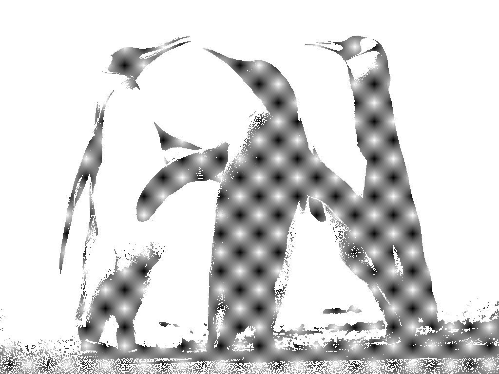
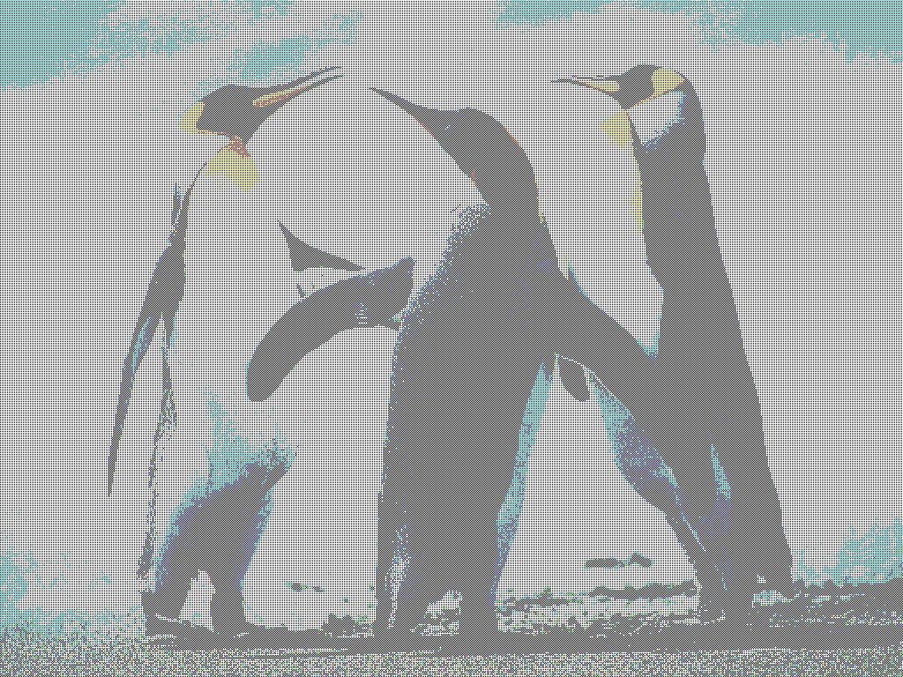
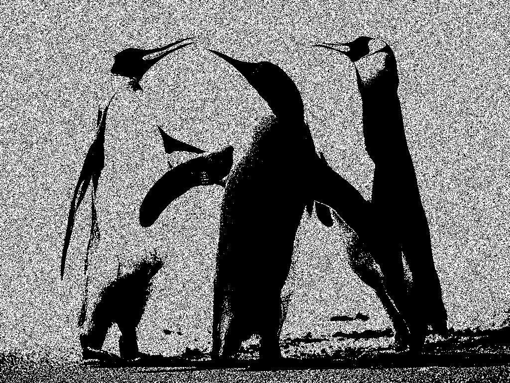
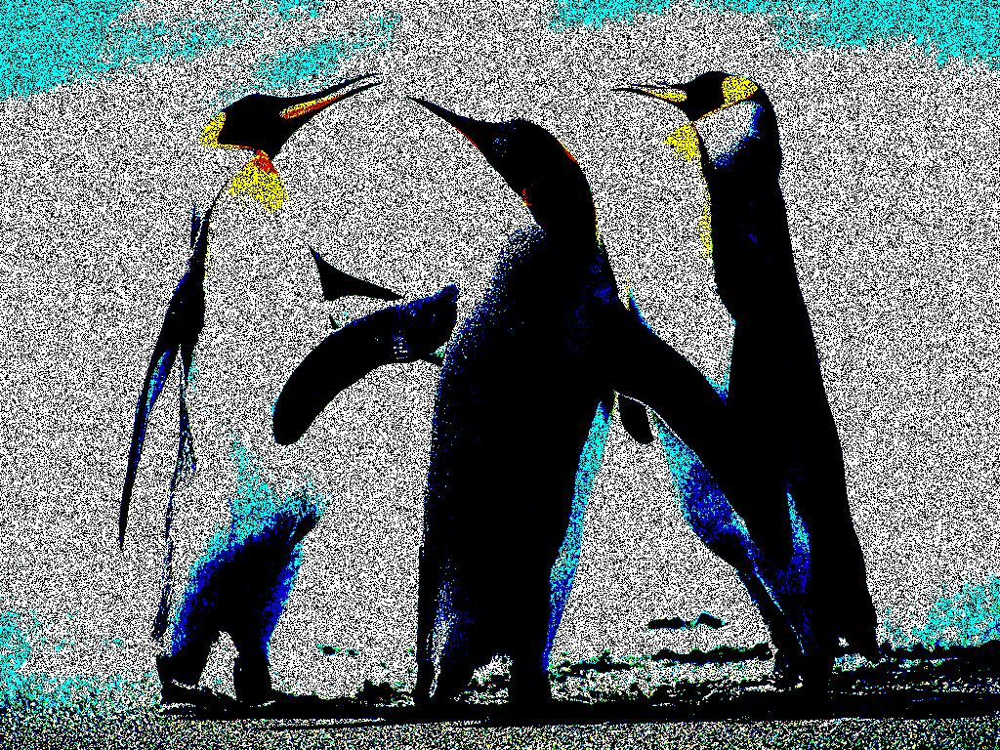
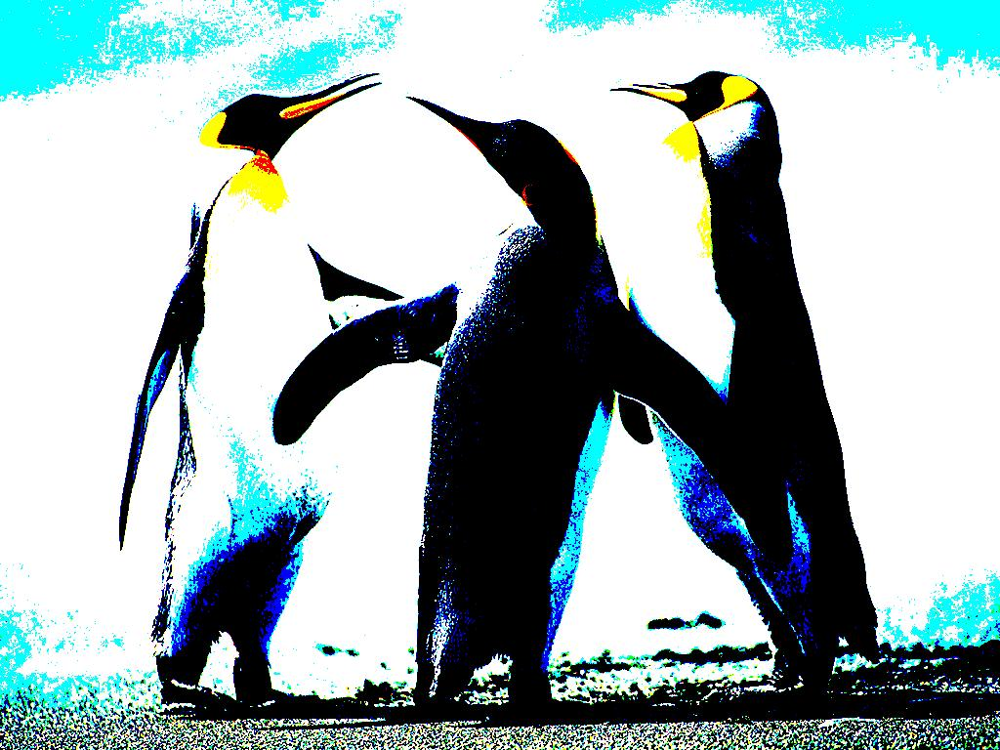
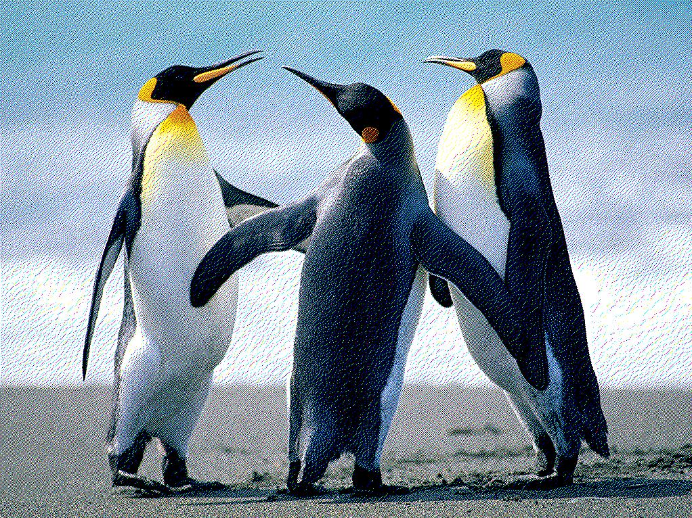
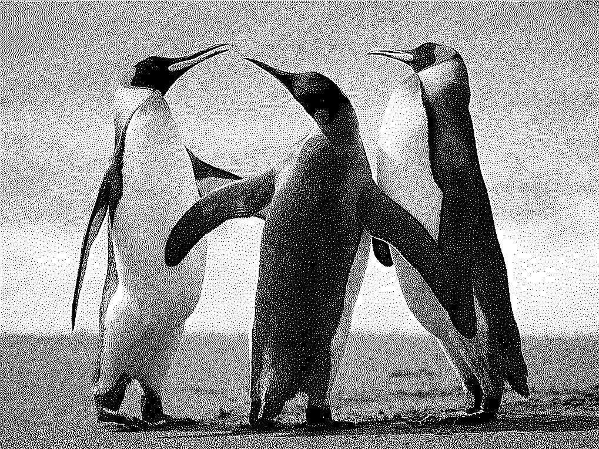

# Dithering

A numer of Dithering methods implemented in python

Methods:
+ Bayer Dithering
+ White Noise Dithering
+ Blue Noise Dithering
+ Custom Kernel Dithering (which includes methods: Atkinson, Floyd-Steinberg, Jarvis-Judice-Ninke dithering)

## Bayer Dithering

```
img = bayer_dither('Data/Penguins.jpg',num_colors = 2,kernel_size = 2,scale_factor = 0.1,Binary_dithering = False,Grayscale = False,verbose = True)
img = bayer_dither('Data/Penguins.jpg',num_colors = 2,kernel_size = 2,scale_factor = 0.1,Binary_dithering = True,Grayscale = True,verbose = True)
```

| Original                       | Bayer Grayscale                              | Bayer Full-Color                                           |
|--------------------------------|----------------------------------------------|------------------------------------------------------------|
|  |  |  |

## White Noise Dithering

```
img = white_noise_dither('Data/Penguins.jpg', num_colors = 2, scale_factor = 0.1, Binary_dithering = True, Grayscale = True)
img = white_noise_dither('Data/Penguins.jpg', num_colors = 2, scale_factor = 0.1, Binary_dithering = True, Grayscale = False)
```

| Original                       | White Noise Grayscale                                              | White Noise Full-Color                                               |
|--------------------------------|--------------------------------------------------------------------|----------------------------------------------------------------------|
|  |  |  |

## Blue Noise Ditheringi

```
img = blue_noise_dither('Data/Penguins.jpg',num_colors = 2, scale_factor = 1, sigma = 5, Binary_dithering = True, Grayscale = True)
img = blue_noise_dither('Data/Penguins.jpg',num_colors = 2, scale_factor = 1, sigma = 5, Binary_dithering = True, Grayscale = False)
```

| Original                       | Blue Noise Grayscale                                             | Blue Noise Full-Color                                              |
|--------------------------------|------------------------------------------------------------------|--------------------------------------------------------------------|
|  |  |  |

## Custom Kernel Dithering

```
img = custom_kernel_dither('Data/Penguins.jpg',num_colors = 2, Kernel = [[None, 0.5],[0.5, 0]], Grayscale = True, verbose = True)
img = custom_kernel_dither('Data/Penguins.jpg',num_colors = 2, Kernel = [[None, 0.5],[0.5, 0]], Grayscale = False, verbose = True)
```

| Original                       | Simple Error Diffusion Grayscale                                         | Simple Error Diffusion Full-Color                                    |
|--------------------------------|--------------------------------------------------------------------------|----------------------------------------------------------------------|
|  |  |  |

```
img = custom_kernel_dither('Data/Penguins.jpg',num_colors = 2, Kernel = 'Atkinson', Grayscale = True, verbose = True)
img = custom_kernel_dither('Data/Penguins.jpg',num_colors = 2, Kernel = 'Atkinson', Grayscale = False, verbose = True)
```

| Original                       | Atkinson Grayscale                                          | Atkinson Full-Color                                     |
|--------------------------------|-------------------------------------------------------------|---------------------------------------------------------|
|  |  |  |

```
img = custom_kernel_dither('Data/Penguins.jpg',num_colors = 2, Kernel = 'Floyd', Grayscale = True, verbose = True)
img = custom_kernel_dither('Data/Penguins.jpg',num_colors = 2, Kernel = 'Floyd', Grayscale = False, verbose = True)
```
| Original                       | Floyd-Steinberg Grayscale                                        | Floyd-Steinberg Full-Color                                        |
|--------------------------------|------------------------------------------------------------------|-------------------------------------------------------------------|
|  |  |  |

```
img = custom_kernel_dither('Data/Penguins.jpg',num_colors = 2, Kernel = 'Jarvis', Grayscale = True, verbose = True)
img = custom_kernel_dither('Data/Penguins.jpg',num_colors = 2, Kernel = 'Jarvis', Grayscale = False, verbose = True)
```
| Original                       | Jarvis-Judice-Ninke Grayscale                                         | Jarvis-Judice-Ninke Full-Color                                    |
|--------------------------------|-----------------------------------------------------------------------|-------------------------------------------------------------------|
|  |  |  |
